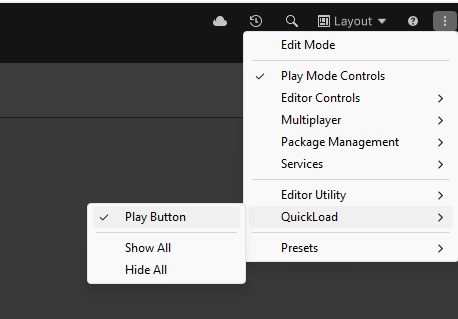
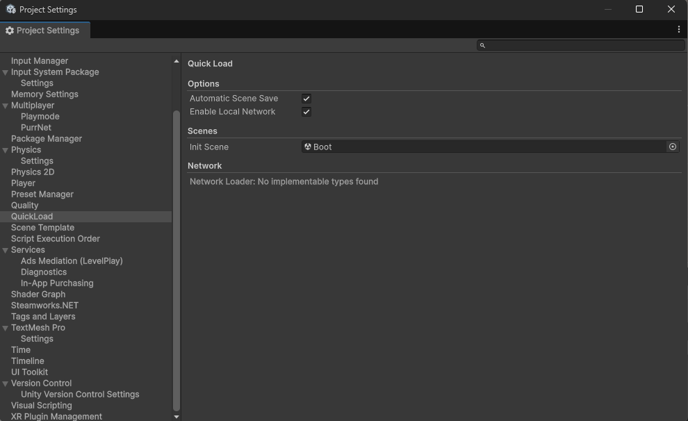
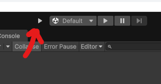

# QuickLoad

QuickLoad is a Unity editor tool that lets you enter Play Mode from any scene without breaking your project's startup flow. Play Mode is routed through a dedicated **Init Scene**, where shared systems are initialized (managers, `DontDestroyOnLoad` objects, service bootstrapping), and then the scene you were working on is loaded. When Play Mode ends, the editor returns to the scene you started from.

## How it works

1. Open the scene you are working on.
2. Click the QuickLoad **Play** button. That's it.

QuickLoad automatically goes through the Init Scene, loads everything your project needs (managers, references, `DontDestroyOnLoad` objects), and then starts the scene you were working on. When you stop Play Mode, the scene you were working on opens again in the editor.

## Requirements

- **Unity 6.0 or newer.** The Play button is a toolbar element and does not exist in older versions.
- (Optional) **Multiplayer Play Mode 2.0.2 or newer**, for testing with virtual players. Older versions are not detected.

## Quick start

### 1. Enable the toolbar button

The button is hidden by default.

1. Click the **three dots** (`⋮`) at the top right of the Unity toolbar.
2. Open **QuickLoad**.
3. Tick **Play Button**.

| Entry | What it does |
|---|---|
| **Play Button** | Shows or hides the QuickLoad Play button in the toolbar. |
| **Show All** | Shows every QuickLoad toolbar element. |
| **Hide All** | Hides every QuickLoad toolbar element. |

If you do not see the button after enabling it, it sits next to the standard Play Mode controls in the main toolbar.

### 2. Set the Init Scene

1. Open **Edit → Project Settings → QuickLoad**.
2. Drag your initialization scene into **Init Scene**.

Without an Init Scene the button does nothing and the console shows:
`Init scene path is not set, go to project settings and select initialize scene`.

### 3. Press the QuickLoad Play button

1. Open the scene you want to work on.
2. Press the **QuickLoad Play button**.

What happens:

1. Open scenes are saved.
2. The list of open scenes is remembered.
3. The Init Scene opens and Play Mode starts.
4. The Init Scene runs its `Awake` (for example, moving objects to `DontDestroyOnLoad`).
5. Your scenes load. The first one replaces the Init Scene, the rest are added on top of it.
6. When you stop Play Mode, the scenes you had open are restored in the editor.

The Init Scene does not stay loaded. Only the objects it moved to `DontDestroyOnLoad` survive.

## Settings

**Edit → Project Settings → QuickLoad**

### Options

| Option | Description |
|---|---|
| **Automatic Scene Save** | Saves all open scenes without asking before entering Play Mode. When off, Unity asks whether to save modified scenes. |

### Scenes

| Option | Description |
|---|---|
| **Init Scene** | The scene loaded first when you press QuickLoad Play. Put everything that must exist once there. It is unloaded as soon as your scenes are loaded. |

## Multiplayer Play Mode

QuickLoad works with virtual players from the Multiplayer Play Mode package (2.0.2 or newer).

1. Enable a virtual player in the Multiplayer Play Mode window.
2. Press QuickLoad Play in the main editor.

Virtual players are clone editors. Each clone loads the Init Scene first, then the scenes it started with, so managers and `DontDestroyOnLoad` objects exist in every window. The clone does not restore scenes when it stops, only the main editor does.

## Troubleshooting

| Problem | Fix |
|---|---|
| The QuickLoad button is not in the toolbar | Enable it: `⋮` → QuickLoad → Play Button. Requires Unity 6.0+. |
| Console: `Init scene path is not set` | Set **Init Scene** in Project Settings → QuickLoad. |
| Objects from the Init Scene are missing after Play | Make sure they are moved to `DontDestroyOnLoad` in the Init Scene's `Awake`. |
| A virtual player is missing objects from the Init Scene | Set an **Init Scene**. Clones need it to bootstrap. |
| Virtual players are not recognized as clones | Multiplayer Play Mode must be version 2.0.2 or newer. |

## Roadmap

- Network providers and a selectable Network Loader for local network testing.
